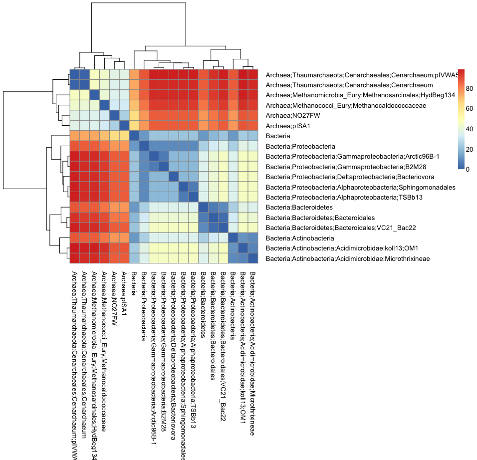

# Taxonomic Variance Notes
Niels Hanson, Aria Hahn  
December 29, 2014  


## Aria's Initial Experience with the Vegan package

Notes on Taxonomic Variance.

* load libraries


```r
library(vegan)
```

```
## Warning: package 'vegan' was built under R version 3.1.2
```

```
## Loading required package: permute
## Loading required package: lattice
## This is vegan 2.2-0
```

```r
library(pheatmap)
```

* load the test data


```r
data(dune)
data(dune.taxon)
```

* run through the example data


```r
# calculate the taxonomic distance
taxdis <- taxa2dist(dune.taxon, varstep=TRUE)
# plot the tree
taxontree <- hclust(taxa2dist(dune.taxon))
plot(taxontree)
```

 

* Vegan's implementation of the taxonomic distance


```r
mod <- taxondive(dune, taxdis)
summary(mod)
```

```
##            Delta  Delta*  Delta+ sd(Delta+) z(Delta+) Pr(>|z|)   
## 1        25.0089 32.1543 51.5455     9.5637   -2.8405 0.004504 **
## 2        60.4931 66.3497 66.6869     4.6664   -2.5769 0.009970 **
## 3        46.5985 51.7024 70.7475     4.6664   -1.7067 0.087881 . 
## 4        58.1988 63.1763 73.4033     3.5073   -1.5135 0.130150   
## 5        72.0452 76.9903 77.6024     3.2187   -0.3446 0.730386   
## 6        76.4148 83.1205 80.8430     4.2170    0.5054 0.613259   
## 7        70.2500 75.4752 78.3974     3.5073   -0.0896 0.928626   
## 8        59.1259 63.4363 74.7865     3.8361   -1.0232 0.306220   
## 9        56.9481 60.9854 71.1597     3.5073   -2.1532 0.031303 * 
## 10       68.9021 74.5133 77.7617     3.8361   -0.2476 0.804432   
## 11       76.2014 85.1259 82.5379     5.2089    0.7346 0.462605   
## 12       69.5554 77.7922 82.6136     5.2089    0.7491 0.453792   
## 13       55.2961 62.9232 76.6566     4.6664   -0.4404 0.659657   
## 14       77.6087 89.2500 88.1818     6.7459    1.4039 0.160362   
## 15       74.9245 84.2485 86.5584     5.8818    1.3341 0.182178   
## 16       57.8435 66.5389 73.3604     5.8818   -0.9098 0.362936   
## 17       64.8225 72.4081 70.9740     6.7459   -1.1470 0.251377   
## 18       76.7314 85.7730 81.4015     5.2089    0.5164 0.605570   
## 19       73.4487 81.3182 83.3712     5.2089    0.8945 0.371029   
## 20       78.0762 87.0634 87.9221     5.8818    1.5659 0.117368   
## Expected 73.2888 70.1816 78.7116                                 
## ---
## Signif. codes:  0 '***' 0.001 '**' 0.01 '*' 0.05 '.' 0.1 ' ' 1
```

* Vegan's implementation of the distance.


```r
my_dist <- function (x, varstep = FALSE, check = TRUE, labels) 
{
    rich <- apply(x, 2, function(taxa) length(unique(taxa)))
    S <- nrow(x)
    if (check) {
        keep <- rich < S & rich > 1
        rich <- rich[keep]
        x <- x[, keep]
    }
    i <- rev(order(rich))
    x <- x[, i]
    rich <- rich[i]
    if (varstep) {
        add <- -diff(c(nrow(x), rich, 1))
        add <- add/c(S, rich)
        add <- add/sum(add) * 100
    }
    else {
        add <- rep(100/(ncol(x) + check), ncol(x) + check)
    }
    if (!is.null(names(add))) 
        names(add) <- c("Base", names(add)[-length(add)])
    if (!check) 
        add <- c(0, add)
    out <- matrix(add[1], nrow(x), nrow(x))
    for (i in 1:ncol(x)) {
        out <- out + add[i + 1] * outer(x[, i], x[, i], "!=")
    }
    out <- as.dist(out)
    attr(out, "method") <- "taxa2dist"
    attr(out, "steps") <- add
    if (missing(labels)) {
        attr(out, "Labels") <- rownames(x)
    }
    else {
        if (length(labels) != nrow(x)) 
            warning("Labels are wrong: needed ", nrow(x), " got ", 
                length(labels))
        attr(out, "Labels") <- as.character(labels)
    }
    if (!check && any(out <= 0)) 
        warning("you used 'check=FALSE' and some distances are zero -- was this intended?")
    out
}
```

* calculation of the taxonomic variance statistics


```r
function (comm, dis, match.force = FALSE) 
{
    binary <- FALSE
    comm <- as.matrix(comm)
    if (missing(dis)) {
        n <- ncol(comm)
        dis <- structure(rep(1, n * (n - 1)/2), Size = n, class = "dist")
    }
    dis <- as.dist(dis)
    if (match.force || attr(dis, "Size") != ncol(comm)) {
        if (match.force) 
            message("Forced matching 'dis' labels and 'comm' names")
        else message("Dimensions do not match between 'comm' and 'dis'")
        if (all(colnames(comm) %in% labels(dis))) {
            dis <- as.matrix(dis)
            dis <- as.dist(dis[colnames(comm), colnames(comm)])
            message("Matched 'dis' labels by 'comm' names")
        }
        else {
            stop("Could not match names in 'dis' and 'comm'")
        }
        if (length(unique(colnames(comm))) != ncol(comm)) 
            stop("Names not in unique in 'comm': match wrong")
        if (length(unique(labels(dis))) != attr(dis, "Size")) 
            warning("Labels not unique in 'dis': matching probably wrong")
    }
    del <- dstar <- dplus <- Ed <- Edstar <- edplus <- NULL
    if (!binary) {
        del <- apply(comm, 1, function(x) sum(as.dist(outer(x, x)) * dis))
        dstar <- apply(comm, 1, function(x) sum(dis * (xx <- as.dist(outer(x, x))))/sum(xx))
        rs <- rowSums(comm)
        del <- del/rs/(rs - 1) * 2
        cs <- colSums(comm)
        tmp <- sum(as.dist(outer(cs, cs)) * dis)
        Ed <- tmp/sum(cs)/sum(cs - 1) * 2
        Edstar <- tmp/sum(cs)/(sum(cs) - 1) * 2
    }
    comm <- ifelse(comm > 0, 1, 0)
    dplus <- apply(comm, 1, function(x) sum(as.dist(outer(x, x)) * dis))
    Lambda <- apply(comm, 1, function(x) sum(as.dist(outer(x, x)) * dis^2))
    m <- rowSums(comm)
    dplus <- dplus/m/(m - 1) * 2
    Lambda <- Lambda/m/(m - 1) * 2 - dplus^2
    S <- attr(dis, "Size")
    omebar <- sum(dis)/S/(S - 1) * 2
    varome <- sum(dis^2)/S/(S - 1) * 2 - omebar^2
    omei <- rowSums(as.matrix(dis))/(S - 1)
    varomebar <- sum(omei^2)/S - omebar^2
    vardplus <- 2 * (S - m)/(m * (m - 1) * (S - 2) * (S - 3)) * 
        ((S - m - 1) * varome + 2 * (S - 1) * (m - 2) * varomebar)
    out <- list(Species = m, D = del, Dstar = dstar, Lambda = Lambda, 
        Dplus = dplus, sd.Dplus = sqrt(vardplus), SDplus = m * 
            dplus, ED = Ed, EDstar = Edstar, EDplus = omebar)
    class(out) <- "taxondive"
    out
}
```

* Try it out with our data


```r
taxon.test = read.table("data/Phylodisttest.txt", header=TRUE, row.names="row.names", sep ="\t")
#taxon.test = taxon.test[,-5]
```

* build a tree based on the distances between taxa: Vary step lengths between successive levels relative to proportional loss of the number of distinct classes


```r
taxontree <- hclust(taxa2dist(taxon.test, varstep=TRUE))
plot(taxontree, las =1)
```

 

* Uniform step lengths


```r
taxontree2 <- hclust(taxa2dist(taxon.test))
plot(taxontree2, las =1)
```

 


```r
taxontree3 <- hclust(taxa2dist(taxon.test, check=TRUE))
plot(taxontree3)
```

 


```r
taxontree4 <- hclust(taxa2dist(taxon.test, varstep=TRUE, check=TRUE))
plot(taxontree4)
```

 

## WTD in R

* source the implementation of `my_taxa2dist`:


```r
source("r_scripts/my_utilities.R")
```

* we'll do an extremely simple test to do a sanity check of the implementation


```r
simple_test1 <- read.table("data/simple_test1.txt", header=TRUE, row.names="row.names", sep ="\t")
simple_test1_dist <- my_taxa2dist(simple_test1, check=FALSE, wtd=TRUE)
simple_test1_dist
```

```
##         A;B;C;D A;B;E;-
## A;B;E;-   0.625        
## A;F;-;-   1.375   1.250
```


```r
plot(hclust(simple_test1_dist))
```

 

* We'll do another quick test with a sub-set of Aria's data.
* Perform hierarhcical clustering


```r
taxon.test.wtd <- my_taxa2dist(taxon.test, check=FALSE, wtd=TRUE)
taxontree <- hclust(taxon.test.wtd)
plot(taxontree, las =1)
```

 

* looks reasonable, lets take a look at a heatmap


```r
pheatmap(as.matrix(taxon.test.wtd), treeheight_row=100, treeheight_col=100)
```

 


