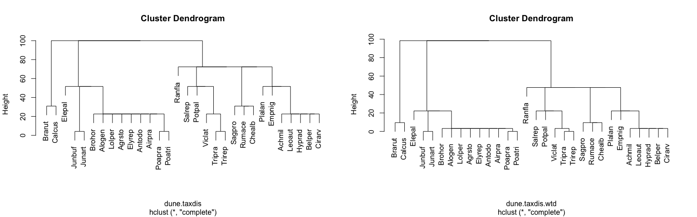

# Taxonomic Variance Notes
Niels Hanson, Aria Hahn  
December 29, 2014  


## Aria's Initial Experience with the Vegan package

Notes on Taxonomic Variance.

* load libraries


```r
library(vegan)
```

```
## Loading required package: permute
## Loading required package: lattice
## This is vegan 2.0-10
```

```r
library(pheatmap)
```

* load the test data


```r
data(dune)
data(dune.taxon)
```

* run through the example data


```r
# calculate the taxonomic distance
taxdis <- taxa2dist(dune.taxon, varstep=TRUE)
# plot the tree
taxontree <- hclust(taxa2dist(dune.taxon, check=FALSE))
```

```
## Warning: you used 'check=FALSE' and some distances are zero -- was this
## intended?
```

```r
plot(taxontree)
```

 

* Vegan's implementation of the taxonomic distance


```r
mod <- taxondive(dune, taxdis)
summary(mod)
```

```
##          Delta Delta* Delta+ sd(Delta+) z(Delta+) Pr(>|z|)   
## 2        60.57  66.44  66.78       4.29     -3.00   0.0027 **
## 13       57.21  65.10  77.90       4.29     -0.41   0.6847   
## 4        58.31  63.29  73.46       3.20     -1.93   0.0535 . 
## 16       62.73  72.15  77.14       5.45     -0.46   0.6456   
## 6        76.35  83.05  80.78       3.87      0.29   0.7692   
## 1        25.20  32.40  51.71       8.97     -3.12   0.0018 **
## 8        62.88  67.46  77.41       3.51     -0.64   0.5250   
## 5        72.02  76.97  77.58       2.93     -0.70   0.4818   
## 17       64.82  72.41  70.97       6.27     -1.38   0.1664   
## 15       77.81  87.50  88.15       5.45      1.56   0.1183   
## 10       68.92  74.53  77.75       3.51     -0.54   0.5890   
## 11       76.14  85.06  82.41       4.81      0.58   0.5648   
## 9        60.34  64.62  73.54       3.20     -1.91   0.0568 . 
## 18       76.63  85.66  81.26       4.81      0.34   0.7368   
## 3        46.75  51.87  70.83       4.29     -2.05   0.0402 * 
## 20       79.81  88.99  89.38       5.45      1.79   0.0737 . 
## 14       78.44  90.21  88.81       6.27      1.46   0.1438   
## 19       73.34  81.20  83.22       4.81      0.74   0.4571   
## 12       71.20  79.63  83.76       4.81      0.86   0.3923   
## 7        71.00  76.29  79.37       3.20     -0.08   0.9330   
## Expected 74.59  71.43  79.64                                 
## ---
## Signif. codes:  0 '***' 0.001 '**' 0.01 '*' 0.05 '.' 0.1 ' ' 1
```

* Vegan's implementation of the distance.


```r
my_dist <- function (x, varstep = FALSE, check = TRUE, labels) 
{
    rich <- apply(x, 2, function(taxa) length(unique(taxa)))
    S <- nrow(x)
    if (check) {
        keep <- rich < S & rich > 1
        rich <- rich[keep]
        x <- x[, keep]
    }
    i <- rev(order(rich))
    x <- x[, i]
    rich <- rich[i]
    if (varstep) {
        add <- -diff(c(nrow(x), rich, 1))
        add <- add/c(S, rich)
        add <- add/sum(add) * 100
    }
    else {
        add <- rep(100/(ncol(x) + check), ncol(x) + check)
    }
    if (!is.null(names(add))) 
        names(add) <- c("Base", names(add)[-length(add)])
    if (!check) 
        add <- c(0, add)
    out <- matrix(add[1], nrow(x), nrow(x))
    for (i in 1:ncol(x)) {
        out <- out + add[i + 1] * outer(x[, i], x[, i], "!=")
    }
    out <- as.dist(out)
    attr(out, "method") <- "taxa2dist"
    attr(out, "steps") <- add
    if (missing(labels)) {
        attr(out, "Labels") <- rownames(x)
    }
    else {
        if (length(labels) != nrow(x)) 
            warning("Labels are wrong: needed ", nrow(x), " got ", 
                length(labels))
        attr(out, "Labels") <- as.character(labels)
    }
    if (!check && any(out <= 0)) 
        warning("you used 'check=FALSE' and some distances are zero -- was this intended?")
    out
}
```

* calculation of the taxonomic variance statistics


```r
function (comm, dis, match.force = FALSE) 
{
    binary <- FALSE
    comm <- as.matrix(comm)
    if (missing(dis)) {
        n <- ncol(comm)
        dis <- structure(rep(1, n * (n - 1)/2), Size = n, class = "dist")
    }
    dis <- as.dist(dis)
    if (match.force || attr(dis, "Size") != ncol(comm)) {
        if (match.force) 
            message("Forced matching 'dis' labels and 'comm' names")
        else message("Dimensions do not match between 'comm' and 'dis'")
        if (all(colnames(comm) %in% labels(dis))) {
            dis <- as.matrix(dis)
            dis <- as.dist(dis[colnames(comm), colnames(comm)])
            message("Matched 'dis' labels by 'comm' names")
        }
        else {
            stop("Could not match names in 'dis' and 'comm'")
        }
        if (length(unique(colnames(comm))) != ncol(comm)) 
            stop("Names not in unique in 'comm': match wrong")
        if (length(unique(labels(dis))) != attr(dis, "Size")) 
            warning("Labels not unique in 'dis': matching probably wrong")
    }
    del <- dstar <- dplus <- Ed <- Edstar <- edplus <- NULL
    if (!binary) {
        del <- apply(comm, 1, function(x) sum(as.dist(outer(x, x)) * dis))
        dstar <- apply(comm, 1, function(x) sum(dis * (xx <- as.dist(outer(x, x))))/sum(xx))
        rs <- rowSums(comm)
        del <- del/rs/(rs - 1) * 2
        cs <- colSums(comm)
        tmp <- sum(as.dist(outer(cs, cs)) * dis)
        Ed <- tmp/sum(cs)/sum(cs - 1) * 2
        Edstar <- tmp/sum(cs)/(sum(cs) - 1) * 2
    }
    comm <- ifelse(comm > 0, 1, 0)
    dplus <- apply(comm, 1, function(x) sum(as.dist(outer(x, x)) * dis))
    Lambda <- apply(comm, 1, function(x) sum(as.dist(outer(x, x)) * dis^2))
    m <- rowSums(comm)
    dplus <- dplus/m/(m - 1) * 2
    Lambda <- Lambda/m/(m - 1) * 2 - dplus^2
    S <- attr(dis, "Size")
    omebar <- sum(dis)/S/(S - 1) * 2
    varome <- sum(dis^2)/S/(S - 1) * 2 - omebar^2
    omei <- rowSums(as.matrix(dis))/(S - 1)
    varomebar <- sum(omei^2)/S - omebar^2
    vardplus <- 2 * (S - m)/(m * (m - 1) * (S - 2) * (S - 3)) * 
        ((S - m - 1) * varome + 2 * (S - 1) * (m - 2) * varomebar)
    out <- list(Species = m, D = del, Dstar = dstar, Lambda = Lambda, 
        Dplus = dplus, sd.Dplus = sqrt(vardplus), SDplus = m * 
            dplus, ED = Ed, EDstar = Edstar, EDplus = omebar)
    class(out) <- "taxondive"
    out
}
```

* Try it out with our data


```r
taxon.test = read.table("data/Phylodisttest.txt", header=TRUE, row.names="row.names", sep ="\t")
#taxon.test = taxon.test[,-5]
```

* build a tree based on the distances between taxa: Vary step lengths between successive levels relative to proportional loss of the number of distinct classes


```r
taxontree <- hclust(taxa2dist(taxon.test, varstep=TRUE))
plot(taxontree, las =1)
```

 

* Uniform step lengths


```r
taxontree2 <- hclust(taxa2dist(taxon.test))
plot(taxontree2, las =1)
```

 


```r
taxontree3 <- hclust(taxa2dist(taxon.test, check=TRUE))
plot(taxontree3)
```

 


```r
taxontree4 <- hclust(taxa2dist(taxon.test, varstep=TRUE, check=TRUE))
plot(taxontree4)
```

 

## WTD in R

* source the implementation of `my_taxa2dist`:


```r
source("r_scripts/my_utilities.R")
```

* we'll do an extremely simple test to do a sanity check of the implementation


```r
simple_test1 <- read.table("data/simple_test1.txt", header=TRUE, row.names="row.names", sep ="\t")
simple_test1_dist <- my_taxa2dist(simple_test1, check=FALSE, wtd=TRUE)
simple_test1_dist
```

```
##         A;B;C;D A;B;E;-
## A;B;E;-   16.13        
## A;F;-;-   35.48   32.26
```


```r
plot(hclust(simple_test1_dist))
```

 

* We'll do another quick test with a sub-set of Aria's data.
* Perform hierarhcical clustering


```r
taxon.test.wtd <- my_taxa2dist(taxon.test, check=FALSE, wtd=TRUE)
taxontree <- hclust(taxon.test.wtd)
plot(taxontree, las =1)
```

 

* looks reasonable, lets take a look at a heatmap


```r
pheatmap(as.matrix(taxon.test.wtd), treeheight_row=100, treeheight_col=100)
```

 

* lets take a look at the `dune` data again,  looks about the same


```r
# calculate the taxonomic distance
taxdis <- my_taxa2dist(dune.taxon, check=FALSE, varstep=FALSE, wtd=TRUE)
```

```
## Warning: you used 'check=FALSE' and some distances are zero -- was this
## intended?
```

```r
# plot the tree
taxontree_wtd <- hclust(taxdis)
par(mfrow=c(2,1))
plot(taxontree)
plot(taxontree_wtd)
```

 

```r
par(mfrow=c(2,1))
mod <- taxondive(dune, taxdis)
summary(mod)
```

```
##          Delta Delta* Delta+ sd(Delta+) z(Delta+) Pr(>|z|)  
## 2        51.65  56.65  56.86       5.55     -2.07    0.038 *
## 13       46.46  52.87  66.74       5.55     -0.29    0.771  
## 4        48.76  52.93  64.51       4.10     -0.94    0.348  
## 16       50.41  57.99  65.99       7.09     -0.33    0.739  
## 6        68.30  74.30  71.52       4.98      0.63    0.526  
## 1        12.89  16.57  40.95      11.85     -2.31    0.021 *
## 8        50.24  53.91  66.62       4.51     -0.38    0.700  
## 5        62.90  67.22  68.13       3.74     -0.06    0.953  
## 17       55.81  62.34  60.32       8.20     -0.98    0.327  
## 15       69.55  78.21  78.46       7.09      1.42    0.154  
## 10       60.32  65.23  68.54       4.51      0.04    0.966  
## 11       68.23  76.22  70.72       6.23      0.38    0.704  
## 9        47.98  51.39  62.68       4.10     -1.38    0.166  
## 18       67.96  75.97  69.31       6.23      0.15    0.878  
## 3        35.92  39.85  62.22       5.55     -1.11    0.269  
## 20       72.63  80.99  81.63       7.09      1.87    0.061 .
## 14       71.22  81.90  79.06       8.20      1.31    0.192  
## 19       62.70  69.42  71.25       6.23      0.47    0.642  
## 12       62.72  70.15  74.60       6.23      1.00    0.316  
## 7        61.94  66.54  69.68       4.10      0.32    0.746  
## Expected 64.58  61.84  68.35                                
## ---
## Signif. codes:  0 '***' 0.001 '**' 0.01 '*' 0.05 '.' 0.1 ' ' 1
```
