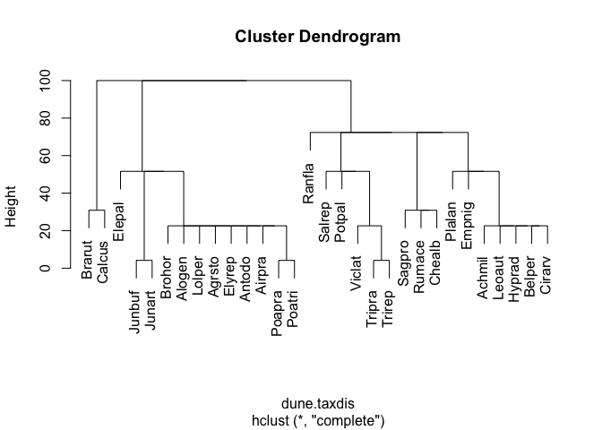
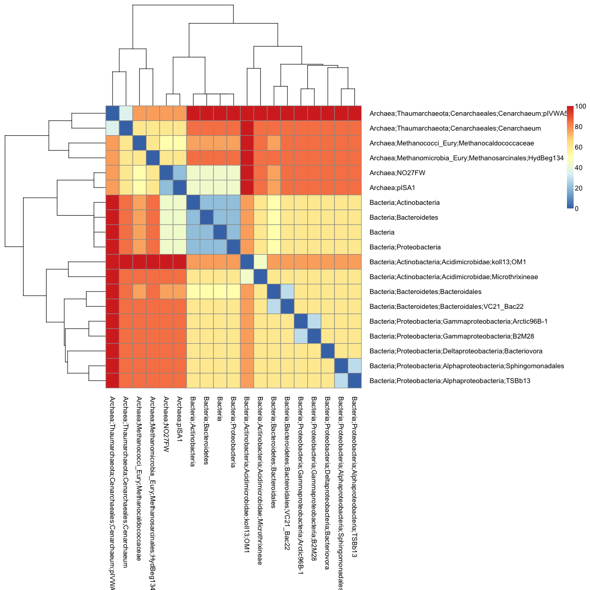
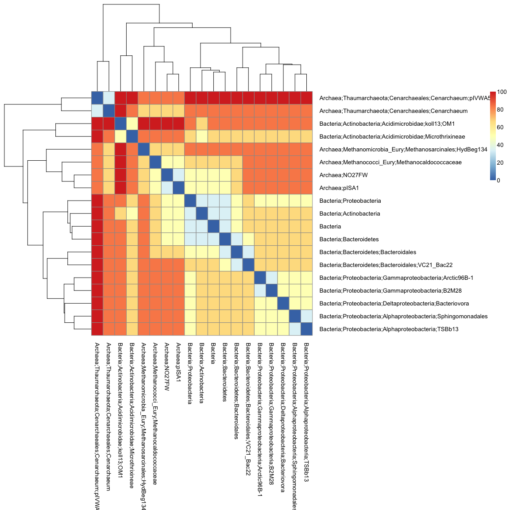
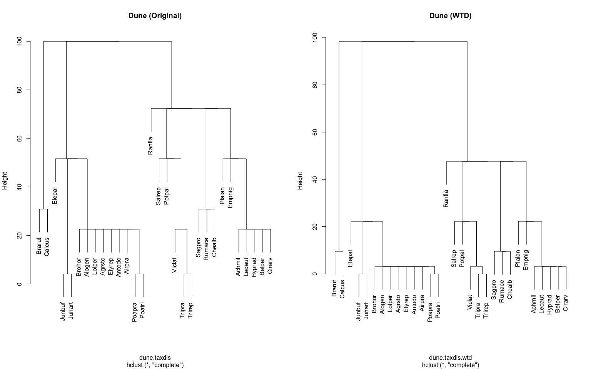

# Taxonomic Diveristy and Distinctness Measures Applied to William's Lake Soil Metagenomes
Niels Hanson, Aria Hahn  
`r format(Sys.time(), '%B %d, %Y')`  


# Summary

This document details the implementation of the Clarke's and Warwick's Diversity and Distinctness measures using the functional annotation to reference genomes [[@Warwick:1995vf, @Pienkowski:1998um, @Clarke:1999tx]]. However, the current implementation in the Vegan package does not take into account incomplete taxonomies [[@Oksanen:2007vs]], a common situation when using functional-genes to infer taxonomy via the Lowest Common Ancestor method in meta'omic samples [[@Huson:2007jl]]. Moreover, we would like to take advantage of properties and intution built into the Weighted Taxonomic Distance (WTD) [[@Hanson:2014bz]], which creates a hard separation between distances accross sub-trees. To accomplish this we implement the calculation of distances from partial taxonomies, allowing the efficient calcuation of WTD matricies. Moreover, we implement a number of analytical utility scripts to format taxonomic lineages the MetaPathways pipeline to create compatible distance and sample abundance matrix. Using the William's Lake (WL) soil metagenoems as a test case, we using that both taxonomic diversity measures, DeltaStar and DeltaPlus, show a positive correlation with increasing depth.

This document shows the development of the method step-by-step. First it describes the original behavior of the implemented taxonomic diversity measures as implemented in the Vegan package, demonstrating their incompatability with partial taxonomcies. Next, we describe the implementation of a matrix form calculation of partial taxonoies, and through weighting demonstrate the implementation of the WTD. Next, we describe the development and use of utility scripts for use with MetaPathways output for creating taxonomies with respect to samples, pathways, and reactions, using presence/absence, ORF counts, or a normalized read-mapping measure, Reads per Kilobase per Million Mapped reads. Finally, we demonstrate the use of this implementation using 25 metagenomic samples from the William's Lake long term soil productivity (LTSP) site, and show that both diversity metrics reflect the increase in taxonomic diversity with increasing depth in the natural, undesturbed treatment, while a flat or negative trend is observed in the clear-cut treatment. 

## Contents

This analysis consists of the following files and data products:

* [scripts/](): Directory containing perl and python scripts to handle MetaPathways output and ePGDBs
     * [extract_pathway_table_from_pgdb.pl](): Slightly-modified version of the MetaPathways script to extract pathways in the 'long' format with pathways and reactions as variables
     * [link_refseq_taxa_to_pathway.py](): Script to link pathway tables with RefSeq Best-HIT, Lowest Common Ancestor (LCA), LCA* taxonomies, as well as RPKM values. This script requires the parsed B/LAST outputs, RPKM files, produced by MetaPathways, and the 'long' pathway tables produced by `extract_pathway_table_from_pgdb.pl` from the ePGDBs. Large tables can be gziped (.gz) for convenience.
     * [extract_LTSP_WL_pwys.sh](): Shell script uses `extract_pathway_table_from_pgdb.pl` to extract WL pathways from Pathway Tools
     * [run_link_refseq_taxa_to_pathway.sh](): Shell script runs `link_refseq_taxa_to_pathway.py` on the WL samples
     * [python_resources/](): Folder containing classes and methods for running `link_refseq_taxa_to_pathway.py`
          * [ncbi_taxonomy_tree.txt](): Slightly-modified NCBI Taxonomy Database Hierarchy.
          * [ncbi.map](): Preferred taxonomy names from NCBI IDs.
          * [LCAStar.py](): Class and functions for calculating LCA, MEGAN Taxonomy, and LCA*.

* [annotations/](): Directory containing RefSeq annotations (`.LASTout.parsed.txt.gz`), RPKM values (`.orf_rpkm.txt.gz`), and long-style pathway tables (`.long.pwy.txt.gz`) for the WL LTSP samples.
* [r_scripts/](): Directory of r functions.
     * [my_taxa2dist.R](): Modifiction of the `taxa2dist()` to handle partial taxonomies and the WTD
* [data/](): Processed data ready for analysis in R
     * [simple_test.txt](): Very basic taxonomy matrix with incomplete taxonomies for testing our implementation
     * [Phylodisttest.txt](): Matrix of partial taxonomies from the WL LTSP samples 
     * [LTSP_WL_MappingandInfo_clean.csv](): Matrix of metadata, chemistry and experiemntal conditions for the WL samples
          * [pwy_taxa/](): long-style pathway tables with LCA taxonomies and RPKM values from the LTSP samples
     * [temp/](): Directory to store previous `.Rdata` files for fast processing. Remove contents of this directory to reboot the analysis and reprocess taxonomic distance matrix
* [figures/](): Directory for pdf figures in the analysis.

## R Libraries

* Load R libraries


```r
library(vegan)
library(pheatmap)
library(dplyr)
library(ggplot2)
library(reshape2)
library(RColorBrewer)
figure_dir <- paste(wd, "figures", sep="/")
```

# Implementation

The initial implementation in VEGAN does allow for incomplete taxonomies. In this section we demonstrate this behavior using the Dutch Dune dataset and a subset of the WL LTSP partial taxonomies. The Dutch Dune Meadow dataset has full taxonomies and is not particularly large compared to the number of unique taxonomies found in environmental datasets. We observe that the current implementation of `taxa2dist`, while improved to some degree class-based scaling, produces distances that do not respect partial taxonomies.

* Load the Dutch Dune Meadow data.


```r
data(dune)
data(dune.taxon)
```

* Run through the example data


```r
# calculate the taxonomic distance
dune.taxdis <- taxa2dist(dune.taxon, varstep=TRUE)
# plot the tree
dune.taxontree <- hclust(dune.taxdis)
plot(dune.taxontree)
```

 

* Plotting the matrix as a heatmap will show the structure in more detail


```r
pheatmap(taxdis, treeheight_row=150, treeheight_col=150)
```

 

* Vegan's implementation of the taxonomic distance


```r
mod <- taxondive(dune, taxdis)
summary(mod)
```

```
##          Delta Delta* Delta+ sd(Delta+) z(Delta+) Pr(>|z|)  
## 2        51.65  56.65  56.86       5.55     -2.07    0.038 *
## 13       46.46  52.87  66.74       5.55     -0.29    0.771  
## 4        48.76  52.93  64.51       4.10     -0.94    0.348  
## 16       50.41  57.99  65.99       7.09     -0.33    0.739  
## 6        68.30  74.30  71.52       4.98      0.63    0.526  
## 1        12.89  16.57  40.95      11.85     -2.31    0.021 *
## 8        50.24  53.91  66.62       4.51     -0.38    0.700  
## 5        62.90  67.22  68.13       3.74     -0.06    0.953  
## 17       55.81  62.34  60.32       8.20     -0.98    0.327  
## 15       69.55  78.21  78.46       7.09      1.42    0.154  
## 10       60.32  65.23  68.54       4.51      0.04    0.966  
## 11       68.23  76.22  70.72       6.23      0.38    0.704  
## 9        47.98  51.39  62.68       4.10     -1.38    0.166  
## 18       67.96  75.97  69.31       6.23      0.15    0.878  
## 3        35.92  39.85  62.22       5.55     -1.11    0.269  
## 20       72.63  80.99  81.63       7.09      1.87    0.061 .
## 14       71.22  81.90  79.06       8.20      1.31    0.192  
## 19       62.70  69.42  71.25       6.23      0.47    0.642  
## 12       62.72  70.15  74.60       6.23      1.00    0.316  
## 7        61.94  66.54  69.68       4.10      0.32    0.746  
## Expected 64.58  61.84  68.35                                
## ---
## Signif. codes:  0 '***' 0.001 '**' 0.01 '*' 0.05 '.' 0.1 ' ' 1
```

* Try it out with some partial taxonomies


```r
taxon.test = read.table(paste(wd, "data/Phylodisttest.txt", sep="/"), header=TRUE, row.names="row.names", sep ="\t")
```

* Build a tree based on the distances as calculated via the original implementation of taxa2dist in Vegan. We will vary the step lengths between successive levels relative to proportional loss of the number of distinct classes.


```r
taxon.test.matrix <- taxa2dist(taxon.test, varstep=TRUE)
taxontree <- hclust(taxon.test.matrix)
plot(taxontree)
```

 

* Structure with number of distinct class step lengths.


```r
pheatmap(taxon.test.matrix, treeheight_row=150, treeheight_col=150)
```

 

```r
pdf(file = paste(figure_dir, "WL_matrix_class_step.pdf", sep="/"), width=12, height=12)
pheatmap(as.matrix(taxon.test.wtd), treeheight_row=150, treeheight_col=150)
dev.off()
```

```
## pdf 
##   2
```

* Uniform step lengths


```r
taxon.test.matrix2 <- taxa2dist(taxon.test)
taxontree2 <- hclust(taxon.test.matrix2)
plot(taxontree2)
```

 

* Structure with uniform step lengths.


```r
pheatmap(taxon.test.matrix2, treeheight_row=150, treeheight_col=150)
```

 

## Implementing WTD and Partial Taxonomy

This demonstrates our implementation of the weighted taxonomic distance and partial taxonomies in `my_taxa2dist.R`, a slightly modified version of the original. 

*TODO: Add some details of the matrix form exclusive OR and the outer product form of the taxonomic distance matrix.*

* source the implementation of `my_taxa2dist`:


```r
source(paste(wd, "r_scripts/my_taxa2dist.R", sep="/"))
```

* we'll do a simple test to do a sanity check of the implementation


```r
simple_test1 <- read.table(paste(wd, "data/simple_test.txt", sep="/"), header=TRUE, row.names="row.names", sep ="\t")
simple_test1_dist <- my_taxa2dist(simple_test1, check=FALSE, wtd=TRUE)
simple_test1_dist
```

```
##         A;B;C;D A;B;E;-
## A;B;E;-   16.13        
## A;F;-;-   35.48   32.26
```

* plot the simple tree


```r
plot(hclust(simple_test1_dist))
```

 

* We'll do another quick test with the LTSP data


```r
taxon.test.wtd <- my_taxa2dist(taxon.test, check=FALSE, wtd=TRUE)
pheatmap(as.matrix(taxon.test.wtd), treeheight_row=150, treeheight_col=150)
```

 

```r
# create pdf
pdf(file = paste(figure_dir, "WL_matrix_wtd.pdf", sep="/"), width=9.9603, height=9.614)
pheatmap(as.matrix(taxon.test.wtd), treeheight_row=150, treeheight_col=150)
dev.off()
```

```
## pdf 
##   2
```

* lets take a look at the Dune data again, looks about the same


```r
# calculate the taxonomic distance
dune.taxdis.wtd <- my_taxa2dist(dune.taxon, check=FALSE, varstep=FALSE, wtd=TRUE)
```

```
## Warning: you used 'check=FALSE' and some distances are zero -- was this
## intended?
```

```r
# plot the tree
dune.taxontree.wtd <- hclust(dune.taxdis.wtd)
par(mfrow=c(1,2))
plot(dune.taxontree, main="Dune (Original)")
plot(dune.taxontree.wtd, main="Dune (WTD)" )
```

 

```r
par(mfrow=c(1,1))

# create pdf
pdf(file = paste(figure_dir, "dune_wtd_compare.pdf", sep="/"), width=16, height=10)
par(mfrow=c(1,2))
plot(dune.taxontree, main="Dune (Original)")
plot(dune.taxontree.wtd, main="Dune (WTD)" )
par(mfrow=c(1,1))
dev.off()
```

```
## pdf 
##   2
```

```r
mod <- taxondive(dune, dune.taxdis.wtd)
summary(mod)
```

```
##          Delta Delta* Delta+ sd(Delta+) z(Delta+) Pr(>|z|)  
## 2        51.65  56.65  56.86       5.55     -2.07    0.038 *
## 13       46.46  52.87  66.74       5.55     -0.29    0.771  
## 4        48.76  52.93  64.51       4.10     -0.94    0.348  
## 16       50.41  57.99  65.99       7.09     -0.33    0.739  
## 6        68.30  74.30  71.52       4.98      0.63    0.526  
## 1        12.89  16.57  40.95      11.85     -2.31    0.021 *
## 8        50.24  53.91  66.62       4.51     -0.38    0.700  
## 5        62.90  67.22  68.13       3.74     -0.06    0.953  
## 17       55.81  62.34  60.32       8.20     -0.98    0.327  
## 15       69.55  78.21  78.46       7.09      1.42    0.154  
## 10       60.32  65.23  68.54       4.51      0.04    0.966  
## 11       68.23  76.22  70.72       6.23      0.38    0.704  
## 9        47.98  51.39  62.68       4.10     -1.38    0.166  
## 18       67.96  75.97  69.31       6.23      0.15    0.878  
## 3        35.92  39.85  62.22       5.55     -1.11    0.269  
## 20       72.63  80.99  81.63       7.09      1.87    0.061 .
## 14       71.22  81.90  79.06       8.20      1.31    0.192  
## 19       62.70  69.42  71.25       6.23      0.47    0.642  
## 12       62.72  70.15  74.60       6.23      1.00    0.316  
## 7        61.94  66.54  69.68       4.10      0.32    0.746  
## Expected 64.58  61.84  68.35                                
## ---
## Signif. codes:  0 '***' 0.001 '**' 0.01 '*' 0.05 '.' 0.1 ' ' 1
```

## Taxonomy and Pathways from MetaPathways

* Slightly modified MetaPathways utility script `extract_pathway_table_from_pgdb.pl` that produces long-table output labeling pathways and reacations
* wrote `scripts/link_refseq_taxa_to_pwy.py` to combine output of pathways in metapathways with parsedblast and RPKM values

```
# Run Pathway Tools in API mode
./pathway-tools/pathway-tools -api

# navigate to the scripts directory 
cd .../scripts/

# Extract pathways
./extract_LTSP_WL_pwys.sh

# Calculate LCA and prepare pathway taxonomies
./run_link_refseq_taxa_to_pathway.sh
```

## Diversity of William's Lake

In order to calculate the disveristy measures, we need to create a distance matrix and a sample by taxa abundance matrix. To do this we will parse all the extract taxonomies and create a non-redunant list of taxonmies, and then use these to create the distance matrix for our samples using the WTD. From here we construct two sample by taxa abundance matricies; the first based on the raw ORF counts, and the second based on the RPKM normalized abundance measure. In both cases we show that the taxonomic diveristy and distinctness measures, delta* and delta+, show a strong positive correlation with depth in the Natural samples, while the treated samples show no clear or negative correlations.

* Various functions for creating properly formatted taxa matrix from partial taxonomies for `my_taxa2dist()`


```r
# fills in the rest of the NA
create_rows <- function(x, max) {
  c(x, rep(NA, max - length(x)))
}

# creates dataframe delimiting the taxonomy hierarchy
create_taxa_df <- function(x) {
  split_taxa <- sapply(x, strsplit, ";")
  lengths <- sapply(split_taxa, length)
  max_length <- max(lengths)
  rows <- lapply(split_taxa, create_rows, max_length)
  rows <- lapply(rows, rev) # reverse rows
  taxa_df <- t(data.frame(rows))
  row.names(taxa_df) <- x
  taxa_df[is.na(taxa_df)] <- "unclassified"
  return(taxa_df)
}
```

* Create a non-redundant list of unique taxonomies for each of the annotations


```r
pwy_taxa_dir <- paste(wd, "data/pwy_taxa/", sep="/")
temp_dir <- paste(wd, "data", "temp", sep="/")

# select files from the pwy_taxa_dir
pwy_taxa_files <- list.files(pwy_taxa_dir, pattern="*taxa.txt.gz")
rdata_files <- list.files(temp_dir, pattern="*.Rdata")

# create non-redundant list of taxonomies for all samples
nr_taxa_list <- c()
if(!("nr_taxa_list.Rdata" %in% rdata_files)) { 
  for (pt_file in pwy_taxa_files) {
    print(pt_file)
    df <- read.table(paste(pwy_taxa_dir, pt_file, sep="/"), header=TRUE, sep="\t",
                   colClasses= c('character', 'character', 'character', 'character', 'character',
                                 'numeric', 'numeric', 'numeric', 'character', 'character', 'numeric'), quote = "")
    my_taxa <- unique(df$TAXONOMY)
    nr_taxa_list <- c(nr_taxa_list, my_taxa)
  }
  # save to disk
  nr_taxa_list <- unique(nr_taxa_list)
  save(nr_taxa_list, file=paste(temp_dir, "nr_taxa_list.Rdata", sep="/"))
} else {
  load(paste(temp_dir, "nr_taxa_list.Rdata", sep="/"))
}
```

* Construct the WTD distance matrix from these annotations


```r
if(!("taxdis.Rdata" %in% rdata_files)) { 
  nr_taxa_list <- unique(nr_taxa_list)
  split_taxa <- sapply(nr_taxa_list, strsplit, ";")
  lengths <- sapply(split_taxa, length)
  max_length <- max(lengths)
  test_df <- create_taxa_df(nr_taxa_list)
  taxdis <- my_taxa2dist(test_df, check=FALSE, varstep=FALSE, wtd=TRUE)

  # save to disk
  save(taxdis, file=paste(temp_dir, "taxdis.Rdata", sep="/"))
} else {
  load(paste(temp_dir, "taxdis.Rdata", sep="/"))
}
```

* Construct the sample by taxa matrix (ORF counts)


```r
sample_taxa_matrix_orfs <- NULL
if(!("sample_taxa_matrix_orfs.Rdata" %in% rdata_files)) { 
  for (pt_file in pwy_taxa_files) {
    print(pt_file)
    df <- read.table(paste(pwy_taxa_dir, pt_file, sep="/"), header=TRUE, sep="\t",
                    colClasses= c('character', 'character', 'character', 'character', 'character',
                                  'numeric', 'numeric', 'numeric', 'character', 'character', 'numeric'), quote = "")
    my_row <- table(df$TAXONOMY)[nr_taxa_list]
    my_row[is.na(my_row)] <- 0
    sample_taxa_matrix_orfs <- rbind(sample_taxa_matrix_orfs,my_row)
  }
  # set sample as row_names
  colnames(sample_taxa_matrix_orfs) <- nr_taxa_list
  row.names(sample_taxa_matrix_orfs) <- sub("-scaffolds.long.pwy.taxa.txt.gz", "", pwy_taxa_files)
  
  save(sample_taxa_matrix_orfs, file=paste(temp_dir, "sample_taxa_matrix_orfs.Rdata", sep="/"))
} else {
  load(paste(temp_dir, "sample_taxa_matrix_orfs.Rdata", sep="/"))
}
```

* Calculate the diversity scores (ORFs)


```r
if(!("diversity_result_orfs.Rdata" %in% rdata_files)) { 
  diversity_result_orfs <- taxondive(sample_taxa_matrix_orfs, taxdis)
  save(diversity_result_orfs, file=paste(temp_dir, "diversity_result_orfs.Rdata", sep="/"))
} else {
  load(paste(temp_dir, "diversity_result_orfs.Rdata", sep="/"))
}
div_res_orfs <- summary(diversity_result_orfs)
div_res_orfs
```

```
##           Delta Delta* Delta+ sd(Delta+) z(Delta+) Pr(>|z|)    
## a26980   2.7137 3.3003 5.5698     0.1332     -3.76  0.00017 ***
## a26981   2.8322 3.3505 5.4568     0.0769     -7.98  1.4e-15 ***
## a26982   2.2138 3.1825 5.7769     0.0972     -3.02  0.00249 ** 
## a26983   2.2642 3.1552 5.8218     0.0748     -3.33  0.00087 ***
## a26984   2.7224 3.3286 5.5259     0.1023     -5.32  1.0e-07 ***
## a26985   2.4068 3.2328 5.7405     0.1304     -2.53  0.01131 *  
## a26986   2.3286 3.1747 5.7405     0.0803     -4.11  3.9e-05 ***
## a26987   2.6503 3.3736 5.7304     0.0653     -5.21  1.8e-07 ***
## a26988   2.7527 3.3767 5.6069     0.0863     -5.38  7.6e-08 ***
## a26989   2.5469 3.2681 5.7316     0.0683     -4.97  6.9e-07 ***
## a26990   2.3658 3.1231 5.6100     0.0782     -5.89  3.8e-09 ***
## a26991   2.5822 3.1533 5.4163     0.1102     -5.94  2.8e-09 ***
## a26992   2.5182 3.0782 5.2842     0.0819     -9.61  < 2e-16 ***
## a26993   2.2502 2.8850 5.4312     0.0764     -8.38  < 2e-16 ***
## a26994   2.2654 2.9682 5.5169     0.0914     -6.06  1.4e-09 ***
## a26995   2.3344 3.1053 5.6767     0.0892     -4.42  9.8e-06 ***
## a26996   2.5730 3.2885 5.7104     0.0635     -5.67  1.4e-08 ***
## a26997   2.6225 3.1627 5.2533     0.0826     -9.90  < 2e-16 ***
## a26998   2.4263 2.9251 5.2527     0.1080     -7.58  3.5e-14 ***
## a26999   2.3172 3.0015 5.5851     0.1039     -4.68  2.9e-06 ***
## a27000   2.3146 3.1123 5.7218     0.0931     -3.75  0.00018 ***
## a27001   2.6208 3.3211 5.7487     0.0740     -4.35  1.4e-05 ***
## a27002   2.6328 3.1738 5.4736     0.0891     -6.70  2.0e-11 ***
## a27003   2.4749 3.1141 5.6398     0.0800     -5.39  7.0e-08 ***
## a27004   2.2728 2.9853 5.5887     0.1029     -4.69  2.8e-06 ***
## a27005   2.6018 3.3216 5.7127     0.0753     -4.76  2.0e-06 ***
## Expected 2.5408 2.5392 6.0709                                  
## ---
## Signif. codes:  0 '***' 0.001 '**' 0.01 '*' 0.05 '.' 0.1 ' ' 1
```

* Load the William's Lake metadata


```r
wl_meta_df <- read.table(paste(wd, "data", "LTSP_WL_MappingandInfo_clean.csv", sep="/"), sep=",", header=TRUE)
```

* Create summary Data Frame (ORFs)


```r
div_res_orfs_matrix <- as.matrix(div_res_orfs)
div_res_orfs_matrix <- cbind(div_res_orfs_matrix[-nrow(div_res_orfs_matrix),], as.matrix(wl_meta_df)) # combine with df
master_df_orfs <- data.frame(delta=as.numeric(div_res_orfs_matrix[,1]),
           delta_star=as.numeric(div_res_orfs_matrix[,2]),
           delta_plus=as.numeric(div_res_orfs_matrix[,3]),
           delta_plus_sd=as.numeric(div_res_orfs_matrix[,4]),
           delta_plus_z=as.numeric(div_res_orfs_matrix[,5]),
           delta_plus_pr=as.numeric(div_res_orfs_matrix[,6]),
           horizon=as.character(div_res_orfs_matrix[,8]),
           treatment=as.character(div_res_orfs_matrix[,9]),
           depth=as.numeric(div_res_orfs_matrix[,10]),
           pH=as.numeric(div_res_orfs_matrix[,11]),
           totalC_percent=as.numeric(div_res_orfs_matrix[,12]),
           totalN_percent=as.numeric(div_res_orfs_matrix[,13]),
           totalorganicN_ppm=as.numeric(div_res_orfs_matrix[,14]),
           nh4_ppm=as.numeric(div_res_orfs_matrix[,15]),
           no3_ppm=as.numeric(div_res_orfs_matrix[,16]))
```

* Depth (cm) by taxonomic diversity (ORFs)


```r
library(ggplot2)
library(reshape2)

p <- ggplot(master_df_orfs, aes(x=depth, y=delta_star)) 
p <- p + geom_smooth(method="glm", size=1.5) 
p <- p + geom_point(size=3.5, aes(col=horizon)) 
p <- p + theme_bw() 
p <- p+ facet_wrap(~treatment)
p
```

 

```r
pdf(file = paste(figure_dir, "wl_delta_star_orfs.pdf", sep="/"), width=9.832, height=4.399)
p
dev.off()
```

```
## pdf 
##   2
```


```r
# delta plus (ORF count)
# quartz(width=9.832677, height=4.399606)
p <- ggplot(master_df_orfs, aes(x=depth, y=delta_plus)) 
p <- p + geom_smooth(formula=y ~ x, method="glm", size=1.5) 
p <- p + geom_point(size=3.5, aes(col=horizon)) 
p <- p + facet_wrap(~treatment) 
p <- p + theme_bw()
p
```

 

```r
pdf(file = paste(figure_dir, "wl_delta_plus_orfs.pdf", sep="/"), width=9.832, height=4.399)
p
dev.off()
```

```
## pdf 
##   2
```

* Construct the sample by taxa matrix (RPKM)


```r
# construct new sample-taxa matrix with RPKM
library(dplyr)

div_res_rpkm_matrix <- NULL
if(!("div_res_rpkm_matrix.Rdata" %in% rdata_files)) { 
  for (pt_file in pwy_taxa_files) {
    print(pt_file)
    df <- read.table(paste(pwy_taxa_dir, pt_file, sep="/"), header=TRUE, sep="\t",
                   colClasses= c('character', 'character', 'character', 'character', 'character',
                                 'numeric', 'numeric', 'numeric', 'character', 'character', 'numeric'), quote = "")
    
    res <- df %>% 
    select(TAXONOMY, RPKM) %>%
    group_by(TAXONOMY) %>% 
    summarize( rpkm=sum(RPKM) )
    
    my_row <- res$rpkm
    names(my_row) <- res$TAXONOMY
    my_row <- my_row[nr_taxa_list]
    my_row[is.na(my_row)] <- 0
    div_res_rpkm_matrix <- rbind(div_res_rpkm_matrix,my_row)
  }
  
  # set sample as row_names
  colnames(div_res_rpkm_matrix) <- nr_taxa_list
  row.names(div_res_rpkm_matrix) <- sub("-scaffolds.long.pwy.taxa.txt.gz", "", pwy_taxa_files)
  
  save(div_res_rpkm_matrix, file=paste(temp_dir, "div_res_rpkm_matrix.Rdata", sep="/"))
} else {
  load(paste(temp_dir, "div_res_rpkm_matrix.Rdata", sep="/"))
}
```

* RPKM diversity results


```r
# calculate taxonomic diversity
if(!("diversity_result_rpkm.Rdata" %in% rdata_files)) { 
  diversity_result_rpkm <- taxondive(div_res_rpkm_matrix, taxdis)
  save(diversity_result_rpkm, file=paste(temp_dir, "diversity_result_rpkm.Rdata", sep="/"))
} else {
  load(paste(temp_dir, "diversity_result_rpkm.Rdata", sep="/"))
}
div_res_rpkm <- summary(diversity_result_rpkm)
div_res_rpkm
```

```
##           Delta Delta* Delta+ sd(Delta+) z(Delta+) Pr(>|z|)    
## a26980   2.7582 3.3028 5.5698     0.1332     -3.76  0.00017 ***
## a26981   2.8108 3.3022 5.4568     0.0769     -7.98  1.4e-15 ***
## a26982   2.2080 3.1538 5.7769     0.0972     -3.02  0.00249 ** 
## a26983   2.2419 3.1257 5.8218     0.0748     -3.33  0.00087 ***
## a26984   2.7352 3.3050 5.5259     0.1023     -5.32  1.0e-07 ***
## a26985   2.3921 3.1079 5.7405     0.1304     -2.53  0.01131 *  
## a26986   2.3291 3.1348 5.7405     0.0803     -4.11  3.9e-05 ***
## a26987   2.6487 3.3712 5.7304     0.0653     -5.21  1.8e-07 ***
## a26988   2.7922 3.3563 5.6069     0.0863     -5.38  7.6e-08 ***
## a26989   2.4247 3.1585 5.7316     0.0683     -4.97  6.9e-07 ***
## a26990   2.5966 3.2776 5.6100     0.0782     -5.89  3.8e-09 ***
## a26991   2.4665 2.9562 5.4163     0.1102     -5.94  2.8e-09 ***
## a26992   2.4386 2.9274 5.2842     0.0819     -9.61  < 2e-16 ***
## a26993   2.1641 2.7446 5.4312     0.0764     -8.38  < 2e-16 ***
## a26994   2.1975 2.8209 5.5169     0.0914     -6.06  1.4e-09 ***
## a26995   2.3287 3.0695 5.6767     0.0892     -4.42  9.8e-06 ***
## a26996   2.5683 3.2973 5.7104     0.0635     -5.67  1.4e-08 ***
## a26997   2.6106 3.1063 5.2533     0.0826     -9.90  < 2e-16 ***
## a26998   2.2570 2.7026 5.2527     0.1080     -7.58  3.5e-14 ***
## a26999   2.2697 2.9213 5.5851     0.1039     -4.68  2.9e-06 ***
## a27000   2.2876 3.0769 5.7218     0.0931     -3.75  0.00018 ***
## a27001   2.5933 3.2820 5.7487     0.0740     -4.35  1.4e-05 ***
## a27002   2.5713 3.0820 5.4736     0.0891     -6.70  2.0e-11 ***
## a27003   2.3883 2.9823 5.6398     0.0800     -5.39  7.0e-08 ***
## a27004   2.2312 2.8925 5.5887     0.1029     -4.69  2.8e-06 ***
## a27005   2.5522 3.3316 5.7127     0.0753     -4.76  2.0e-06 ***
## Expected 2.5189 2.5177 6.0709                                  
## ---
## Signif. codes:  0 '***' 0.001 '**' 0.01 '*' 0.05 '.' 0.1 ' ' 1
```

* RPKM result matrix


```r
res_matrix_rpkm <- as.matrix(div_res_rpkm)
res_matrix_rpkm <- cbind(res_matrix_rpkm[-nrow(res_matrix_rpkm),], as.matrix(wl_meta_df)) # combine with df
master_df_rpkm <- data.frame(delta=as.numeric(res_matrix_rpkm[,1]),
           delta_star=as.numeric(res_matrix_rpkm[,2]),
           delta_plus=as.numeric(res_matrix_rpkm[,3]),
           delta_plus_sd=as.numeric(res_matrix_rpkm[,4]),
           delta_plus_z=as.numeric(res_matrix_rpkm[,5]),
           delta_plus_pr=as.numeric(res_matrix_rpkm[,6]),
           horizon=as.character(res_matrix_rpkm[,8]),
           treatment=as.character(res_matrix_rpkm[,9]),
           depth=as.numeric(res_matrix_rpkm[,10]),
           pH=as.numeric(res_matrix_rpkm[,11]),
           totalC_percent=as.numeric(res_matrix_rpkm[,12]),
           totalN_percent=as.numeric(res_matrix_rpkm[,13]),
           totalorganicN_ppm=as.numeric(res_matrix_rpkm[,14]),
           nh4_ppm=as.numeric(res_matrix_rpkm[,15]),
           no3_ppm=as.numeric(res_matrix_rpkm[,16]))
```

* Depth by taxonomic diversity (RPKM)


```r
# delta_star (RPKM count)
p <- ggplot(master_df_rpkm, aes(x=depth, y=delta_star)) 
p <- p + geom_smooth(method="glm", size=1.5) 
p <- p + geom_point(size=3.5, aes(col=horizon)) 
p <- p + theme_bw() 
p <- p + facet_wrap(~treatment)
p
```

 

```r
pdf(file = paste(figure_dir, "wl_delta_star_rpkm.pdf", sep="/"), width=9.832, height=4.399)
p
dev.off()
```

```
## pdf 
##   2
```


```r
# delta plus (RPKM count)
p <- ggplot(master_df_rpkm, aes(x=depth, y=delta_plus)) 
p <- p + geom_smooth(formula=y ~ x, method="glm", size=1.5) 
p <- p + geom_point(size=3.5, aes(col=horizon)) 
p <- p + facet_wrap(~treatment) 
p <- p + theme_bw()
p
```

 

```r
pdf(file = paste(figure_dir, "wl_delta_plus_rpkm.pdf", sep="/"), width=9.832, height=4.399)
p
dev.off()
```

```
## pdf 
##   2
```

# References

Section for work cited.
